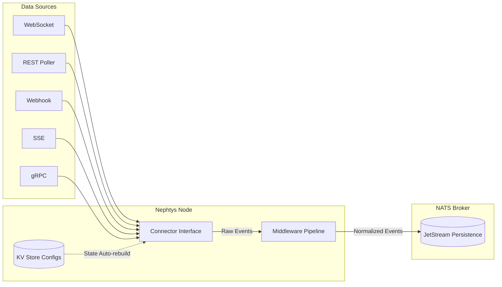

<div align="center">
  
  <h1>Nephtys</h1>
  <p><strong>Real-time data stream connector for the data economy</strong></p>
  <p>
    <a href="https://github.com/AndreaBozzo/Nephtys/actions"></a>
    <a href="https://github.com/AndreaBozzo/Nephtys/blob/main/LICENSE"></a>
    <a href="https://discord.gg/fztdKSPXSz"></a>
  </p>
</div>

---

Nephtys ingests live data streams (WebSocket, webhooks, Server-Sent Events, gRPC), normalizes events into a standard format, and publishes them to NATS JetStream with durable persistence. It exposes a REST API for dynamic stream management and is designed as a standalone service or as part of a larger data processing ecosystem.

> *Named after the Egyptian goddess of the night, rivers, and protector of the dead — she watches over the streams that flow in the dark.*

## Table of Contents

- [Why Nephtys?](#why-nephtys)
- [Key Features](#key-features)
- [Architecture](#architecture)
- [Quick Start](#quick-start)
- [Usage Examples](#usage)
- [REST API Reference](#rest-api)
- [Configuration](#configuration)
- [Supported Connectors](#supported-connectors)
- [Pipeline Middlewares](#pipeline-middlewares)
- [Persistence](#persistence)
- [Development](#development)
- [Contributing](#contributing)

---

## Why Nephtys?

Nephtys is the conceptual sibling of [Ceres](https://github.com/AndreaBozzo/Ceres) and [Ares](https://github.com/AndreaBozzo/Ares) — built with the same philosophy of creating robust, open tooling for data ingestion, but aimed at a distinctly different domain.

- **Ceres** harvests open data portals.
- **Ares** scrapes and extracts structured data from the web.
- **Nephtys** captures data *in motion*.

Where batch jobs fail to provide the immediacy required by algorithmic trading, live monitoring, or real-time ML pipelines, Nephtys steps in to ensure no event is missed, dropping it securely into your reliable, local NATS infrastructure.

## Key Features

- **Real-Time Ingestion:** Supports multiple live protocols securely.
- **Durable Storage:** Backed by NATS JetStream; stream configurations and event payloads persist across restarts seamlessly.
- **Dynamic Middlewares:** Filter, transform, deduplicate, and enrich payloads on the fly, configured via JSON upon stream creation.
- **Zero Extra Infrastructure:** Runs completely independently alongside NATS. No complex databases required.
- **Self-Healing:** Interrupted streams automatically resume and recover using rigorous backoff strategies.
- **Edge Friendly:** Low resource footprint written in Go, perfectly suited for deployment on Edge AI or remote clusters.

## Architecture

Nephtys orchestrates independent connectors through a unified pipeline that outputs directly to highly available JetStream constructs.



## Quick Start

### Prerequisites

- **Go** 1.25+
- **Docker** (to rapidly provision NATS)

### Setup

```bash
# Clone the repository
git clone https://github.com/AndreaBozzo/Nephtys.git
cd Nephtys

# Start NATS with JetStream
docker compose up -d

# Configure environment
cp .env.example .env

# Run Nephtys
make run
```

## Usage

Start your local Nephtys instance with `make run`. The REST API listens on `:3000` (by default) and connects to NATS at `:4222`.

### 1. Register a WebSocket Stream dynamically

```bash
curl -X POST http://localhost:3000/v1/streams \
  -H "Content-Type: application/json" \
  -d '{
    "id": "binance_btc",
    "kind": "websocket",
    "url": "wss://stream.binance.com:9443/ws/btcusdt@trade",
    "topic": "nephtys.stream.crypto.btc",
    "pipeline": {
      "filter": { "match_types": ["trade"] },
      "transform": { "mapping": { "price": "data.p", "qty": "data.q" } },
      "dedup": { "enabled": true, "ttl": "1m" },
      "enrich": { "tags": { "env": "prod" } }
    }
  }'
```

### 2. Verify Active Streams

```bash
curl http://localhost:3000/v1/streams
```

### 3. Remove a Stream

```bash
# Gracefully stops the worker routines and removes the active configuration
curl -X DELETE http://localhost:3000/v1/streams/binance_btc
```

## REST API

| Method | Path | Description |
|--------|------|-------------|
| `GET` | `/health` | Health check (Verifies internal NATS connectivity) |
| `GET` | `/v1/streams` | List all active streams and operational statuses |
| `POST` | `/v1/streams` | Register, save, and start a new stream |
| `DELETE` | `/v1/streams/{id}` | Halt stream ingest and remove it from configuration |

## Configuration

Control the global behavior of the instance via environment variables.

| Variable | Default | Description |
|----------|---------|-------------|
| `NATS_URL` | `nats://localhost:4222` | Broker endpoint address |
| `NEPHTYS_PORT` | `3000` | Port for the management REST API |
| `NEPHTYS_LOG_LEVEL` | `info` | Operational logging verbosity (`debug`, `info`, `warn`, `error`) |

## Supported Connectors

| Kind | Description | Config Keys |
|------|-------------|-------------|
| `websocket` | Standard WebSocket with auto-reconnect and exponential backoff. | `url` |
| `rest_poller` | Periodically requests JSON from REST APIs at given intervals. | `url`, `interval` |
| `sse` | Standard Server-Sent Events bindings. | `url` |
| `webhook` | Local HTTP server listener receiving inbound webhooks. | N/A (Exposed on `/v1/webhooks/{id}`) |
| `grpc` | Direct gRPC data pushes for high-throughput microservices. | `port` |

## Pipeline Middlewares

Nephtys supports deeply customizable, configurable middlewares to process events before JetStream publication. Middlewares are defined directly within the JSON payload on stream registration:

- **Filter**: Discards items intelligently if they do not map to desired event targets.
- **Transform**: Flattens nested variable mappings into cleanly structured top-level metadata values.
- **Dedup**: Provides transient memory footprint deduplication restricting publication floods.
- **Enrich**: Force-injects localized, static tagging markers directly to the JSON outcome.

## Persistence

Nephtys embraces pure streaming infrastructure relying on **JetStream** without external database dependencies:
- **Event Data**: Stored durably on streams with customizable 72h default retention bounds.
- **Stream Configurations**: Synchronized rapidly into a robust KV bucket for instantaneous zero-downtime recovery upon restart.

## Development

```bash
make help       # Display all valid target commands
make build      # Compile the main binary
make test       # Execute test suite coverage
make fmt        # Apply standardized style
make vet        # Execute static analysis checking for code errors
make all        # Run standard commit lifecycle: fmt + vet + test
```

### Docker Management

```bash
make docker-build # Construct the isolated production-ready Docker image
make docker-up    # Spin up backing services (NATS JetStream) specifically for dev
make docker-down  # Destroy active container dependencies
```

## Contributing

Contributions, feature requests, and edge-platform integrations are welcomed enthusiastically! Please refer to the [CONTRIBUTING.md](docs/CONTRIBUTING.md) to kickstart your environment and submit improvements cleanly.

## License

Nephtys is open-source software, freely available under the [Apache-2.0 License](LICENSE).
