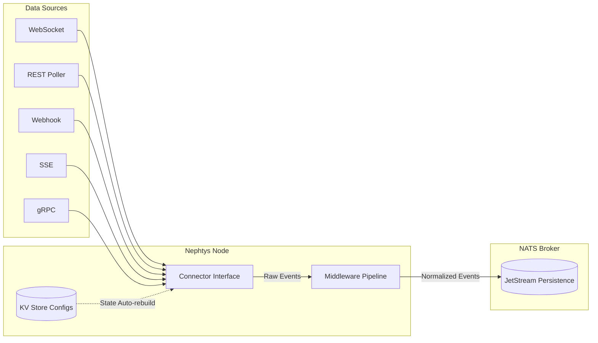

<div align="center">
  <h1>Nephtys</h1>
  <p><strong>Real-time data stream connector for the data economy</strong></p>
  <p>
    <a href="https://github.com/AndreaBozzo/Nephtys/actions"></a>
    <a href="https://codecov.io/gh/AndreaBozzo/Nephtys"></a>
    <a href="https://github.com/AndreaBozzo/Nephtys/blob/main/LICENSE"></a>
    <a href="https://discord.gg/fztdKSPXSz"></a>
  </p>
</div>

---

Nephtys ingests live data streams (WebSocket, webhooks, Server-Sent Events, gRPC), normalizes events into a standard format, and publishes them to NATS JetStream with durable persistence. It exposes a REST API for dynamic stream management and is designed as a standalone service or as part of a larger data processing ecosystem.

> *Named after the Egyptian goddess of the night, rivers, and protector of the dead — she watches over the streams that flow in the dark.*

## Table of Contents

- [Why Nephtys?](#why-nephtys)
- [Use Cases](#use-cases)
- [Key Features](#key-features)
- [Performance](#performance)
- [Architecture](#architecture)
- [Quick Start](#quick-start)
- [Usage Examples](#usage)
- [REST API Reference](#rest-api)
- [Configuration](#configuration)
- [Supported Connectors](#supported-connectors)
- [Pipeline Middlewares](#pipeline-middlewares)
- [Persistence](#persistence)
- [Development](#development)
- [Contributing](#contributing)
- [Citation](#citation)
- [License](#license)

---

## Why Nephtys?

Nephtys is the conceptual sibling of [Ceres](https://github.com/AndreaBozzo/Ceres) and [Ares](https://github.com/AndreaBozzo/Ares) — built with the same philosophy of creating robust, open tooling for data ingestion, but aimed at a distinctly different domain.

- **Ceres** harvests open data portals.
- **Ares** scrapes and extracts structured data from the web.
- **Nephtys** captures data *in motion*.

Where batch jobs fail to provide the immediacy required by algorithmic trading, live monitoring, or real-time ML pipelines, Nephtys steps in to ensure no event is missed, dropping it securely into your reliable, local NATS infrastructure.

Beyond its core design, Nephtys has proven effective at feeding real-time data to AI agents and autonomous systems. The clean normalization and durable JetStream delivery give agents a stable substrate for observing and acting on live environments.

## Use Cases

Nephtys is intentionally generic — it doesn't care what kind of stream you point it at, as long as it's real-time. Common profiles:

- **Urban sensor streams** *(primary framing of the [UIC 2026 paper](#citation))* — air-quality monitors, weather stations, traffic counters, smart-city telemetry. Typically polled (REST) or pushed (SSE/MQTT-over-WS), low-to-moderate event rate, durable archive needed.
- **Market data** — exchange WebSocket feeds for trades, depth, order book snapshots. High event rate, sequencing matters, used by downstream trading agents (e.g. [Mercury](https://github.com/AndreaBozzo/Mercury)).
- **Public event streams** — Wikimedia recent-changes, GitHub events, transit feeds. SSE or WebSocket, useful for monitoring and ML pipelines.
- **AI agent telemetry** — feeding live observations to autonomous agents that need a normalized, durable event substrate.

See [`docs/examples/`](docs/examples/) for runnable configurations covering each profile.

## Key Features

- **Real-time ingestion** across WebSocket, SSE, REST polling, gRPC, and webhook sources.
- **Durable persistence** via NATS JetStream — both event payloads and stream configurations survive restarts.
- **Configurable pipelines** — filter, transform, deduplicate, enrich, threshold, and batch payloads on the fly via JSON config.
- **No extra infrastructure** — runs alongside NATS; no separate database, cache, or coordination service required.
- **Self-healing pull connectors** — `websocket` and `sse` reconnect with exponential backoff; `rest_poller` retries on the next tick. (Inbound `webhook` and `grpc` sources delegate retry to the upstream client — see [Supported Connectors](#supported-connectors).)
- **Edge-friendly footprint** — single Go binary, low memory, suitable for resource-constrained deployments.

## Performance

From the peer-reviewed evaluation for the [UIC 2026 paper](#citation): Nephtys and Node-RED 5.0.1 processed the **same deterministic 12,000-event sensor workload** (identical pipeline semantics, matched accepted-event hashes, three interleaved trials, NATS JetStream sink for both). Same output — a fraction of the footprint:

| Metric (mean ± SD, 3 trials) | Nephtys | Node-RED 5.0.1 |
|---|---|---|
| Tool RSS | **19.1 ± 0.1 MB** | 109.6 ± 0.4 MB |
| Tool + NATS RSS | **27.2 ± 0.1 MB** | 117.3 ± 0.4 MB |
| CPU (100% = 1 logical core) | **0.03 ± 0.02%** | 0.31 ± 0.08% |
| Bandwidth reduction (bytes / messages) | 67.3% / 98.7% | 67.3% / 98.7% |

Both systems achieved identical filtering results; end-to-end p95 latency was equivalent (batch-window dominated).

The same protocol repeated on **real edge hardware** — a Raspberry Pi 5 (4 GB), both tools native — reproduced this, with the gap widening as Node-RED costs 17% more resident memory on ARM64 while Nephtys is essentially unchanged:

| Metric (mean ± SD, 3 trials, Raspberry Pi 5) | Nephtys | Node-RED 5.0.1 |
|---|---|---|
| Tool RSS | **19.5 ± 0.1 MB** | 128.5 ± 0.4 MB |
| Tool + NATS RSS | **38.9 ± 0.1 MB** | 147.1 ± 0.5 MB |
| CPU (100% = 1 logical core) | **0.32 ± 0.00%** | 0.72 ± 0.01% |
| Wall power (whole board, at the socket) | 3.610 ± 0.005 W | 3.584 ± 0.014 W |

Every slot produced the same event-sequence hash and the same 67.3% / 98.7% reduction as on x86-64, and the SoC never throttled. **Note the negative result:** wall power is *indistinguishable* — Nephtys measured 0.7% higher, below the meter's resolution. The Pi's ~3.0 W idle floor dominates at 40 events/s, so the small footprint buys **memory headroom for co-located workloads, not lower power**. Anyone sizing an edge deployment on energy grounds should measure at their own load.

Scope: single node, one workload profile per platform — full protocol, raw counters, recorded deviations, and scripts in the [companion repository](https://github.com/AndreaBozzo/uic2026-nephtys/), summarized in [`docs/benchmarks/`](docs/benchmarks/).

## Architecture

Nephtys orchestrates independent connectors through a unified pipeline that outputs directly to highly available JetStream constructs.


```mermaid
flowchart LR
    subgraph Data Sources
        WS[WebSocket]
        Poll[REST Poller]
        Web[Webhook]
        SSE[SSE]
        GRPC[gRPC]
    end

    subgraph Nephtys Node
        Connector[Connector Interface]
        Pipeline[Middleware Pipeline]
        JS_C[(KV Store Configs)]
        
        Connector --> |Raw Events| Pipeline
    end

    subgraph NATS Broker
        JS[(JetStream Persistence)]
    end

    WS --> Connector
    Poll --> Connector
    Web --> Connector
    SSE --> Connector
    GRPC --> Connector

    Pipeline --> |Normalized Events| JS
    JS_C -.->|State Auto-rebuild| Connector
```

## Quick Start

### Prerequisites

- **Go** 1.25+
- **Docker** (to rapidly provision NATS)

### Setup

```bash
# Clone the repository
git clone https://github.com/AndreaBozzo/Nephtys.git
cd Nephtys

# Start NATS with JetStream
docker compose up -d

# Configure environment
cp .env.example .env

# Run Nephtys
make run
```

## Usage

Start your local Nephtys instance with `make run`. The REST API listens on `:3002` (by default) and connects to NATS at `:4222`.

If `NEPHTYS_ADMIN_TOKEN` is set, stream-management routes require `Authorization: Bearer <token>`. If it is unset, those protected endpoints intentionally return `403`, so the header examples below apply only when auth is enabled.

More runnable examples live in [`docs/examples/`](docs/examples/), including a Wikimedia SSE stream and a Binance WebSocket stream.

### 1. Register a sensor stream (REST poller)

Polls the public Open-Meteo weather API every 60 seconds and publishes normalized events to NATS. No API key required.

```bash
curl -X POST http://localhost:3002/v1/streams \
  -H "Content-Type: application/json" \
  -H "Authorization: Bearer $NEPHTYS_ADMIN_TOKEN" \
  -d @docs/examples/sensor_rest_poller.json
```

This publishes to subject `nephtys.stream.sensors.weather.bologna`. Tap it from a separate terminal:

```bash
nats sub "nephtys.stream.sensors.>"
```

### 2. Register a market-data stream (WebSocket)

```bash
curl -X POST http://localhost:3002/v1/streams \
  -H "Content-Type: application/json" \
  -H "Authorization: Bearer $NEPHTYS_ADMIN_TOKEN" \
  -d '{
    "id": "binance_btc",
    "kind": "websocket",
    "url": "wss://stream.binance.com:9443/ws/btcusdt@trade",
    "topic": "nephtys.stream.crypto.btc",
    "pipeline": {
      "filter": { "match_types": ["trade"] },
      "transform": { "mapping": { "price": "p", "qty": "q", "symbol": "s" } },
      "dedup": { "enabled": true, "ttl": "1m" },
      "enrich": { "tags": { "env": "prod" } }
    }
  }'
```

### 3. Verify active streams

```bash
curl \
  -H "Authorization: Bearer $NEPHTYS_ADMIN_TOKEN" \
  http://localhost:3002/v1/streams
```

### 4. Remove a stream

```bash
# Gracefully stops the worker and removes the persisted configuration
curl -X DELETE http://localhost:3002/v1/streams/binance_btc \
  -H "Authorization: Bearer $NEPHTYS_ADMIN_TOKEN"
```

### WebSocket metadata inference

For JSON WebSocket payloads, Nephtys infers useful envelope metadata without forcing an exchange-specific schema into the connector:
- `e` becomes the event `type`
- `E` becomes the envelope `timestamp`
- `seq`, `u`, `lastUpdateId`, or `t` become the envelope `seq`

This keeps the connector generic while still giving downstream consumers enough sequencing information to build local state safely.

### Binary payloads

When a connector emits raw binary data, Nephtys publishes it directly to NATS instead of JSON-encoding it first. The message carries:
- `Content-Type` header, for example `application/vnd.apache.arrow.stream`
- `X-Nephtys-Seq` header when sequence metadata is available

## REST API

| Method | Path | Description |
|--------|------|-------------|
| `GET` | `/health` | Health check (Verifies internal NATS connectivity) |
| `GET` | `/v1/streams` | List active streams with connector status, health, and last-message time |
| `POST` | `/v1/streams` | Register, save, and start a new stream |
| `DELETE` | `/v1/streams/{id}` | Halt stream ingest and remove it from configuration |
| `PUT` | `/v1/streams/{id}/pipeline` | Update a running stream pipeline |

## Configuration

Control the global behavior of the instance via environment variables.

| Variable | Default | Description |
|----------|---------|-------------|
| `NATS_URL` | `nats://localhost:4222` | Broker endpoint address |
| `NEPHTYS_PORT` | `3002` | Port for the management REST API |
| `NEPHTYS_ADMIN_TOKEN` | unset | Optional bearer token for stream-management endpoints |
| `NEPHTYS_LOG_LEVEL` | `info` | Operational logging verbosity (`debug`, `info`, `warn`, `error`) |

Each `GET /v1/streams` item includes `status`, derived `health` (`healthy`, `degraded`, or `errored`), and `last_message_at` once the source has emitted an event. Prometheus exposes the same connector state as the one-hot `nephtys_stream_state{stream_id,state}` gauge.

### CLI flags

```bash
nephtys --version                                   # print version (VCS-stamped) and exit
nephtys --config-check docs/examples/sensor.json    # validate a stream config and exit (0 = ok, 1 = invalid)
cat config.json | nephtys --config-check -          # same, from stdin (useful in CI)
```

## Supported Connectors

| Kind | Direction | Reconnect | Description | Config Keys |
|------|-----------|-----------|-------------|-------------|
| `websocket` | Outbound (pull) | Auto, exp. backoff | Standard WebSocket. | `url` |
| `rest_poller` | Outbound (pull) | N/A (next tick) | Periodically requests JSON from REST APIs at given intervals. | `url`, `interval` |
| `sse` | Outbound (pull) | Auto, exp. backoff | Standard Server-Sent Events bindings. | `url` |
| `webhook` | Inbound (push) | Client's responsibility | Local HTTP server receiving inbound webhooks. | `port`, `path`, `auth_token` |
| `grpc` | Inbound (push) | Client's responsibility | gRPC server accepting client-streaming pushes. | `port` |

**Reconnect semantics.** Pull connectors (`websocket`, `sse`) reconnect transparently with exponential backoff (1s → 30s) on transient failures; `rest_poller` simply retries on the next tick. Push connectors (`webhook`, `grpc`) do not "reconnect" — they accept whatever the upstream client sends, so retry-on-failure is the *client's* responsibility. If the local HTTP/gRPC server itself fails (rare), the stream enters an error state and must be removed and re-registered.

## Pipeline Middlewares

Pipelines are declared inline on stream registration as JSON. Each middleware is optional; they run in a fixed order (filter → transform → dedup → enrich → threshold → batch) before the event is published.

- **Filter** — drops events whose `type` doesn't match `match_types`.
- **Transform** — remaps fields in the JSON payload using dot-notation paths.
- **Dedup** — short-window LRU deduplication on FNV-1a hashes of the event body. Per-stream and in-memory; state is not shared across instances and does not survive restart. Bounded by `cache_size` (default 1000). `ttl` (default `1m`) is enforced lazily: an entry is fresh until the TTL has elapsed since it was last seen, and treated as expired only when its hash is checked again past that window — stale entries that are never re-seen remain in the LRU until evicted by capacity. Size `cache_size` for at least one full TTL window of expected unique payloads.
- **Enrich** — adds static tags to outgoing events.
- **Threshold** — emits only when a numeric path changes by at least a configured delta (useful for sensor anomaly filtering).
- **Batch** — buffers events into bounded batches before publishing. Flushes on `max_batch_size`, on `flush_interval`, and once more when the stream is stopped or its pipeline is replaced, so buffered events are not discarded.

**Binary payloads and the pipeline.** Events whose `content_type` is anything other than `application/json` carry their bytes outside the JSON envelope. Dedup hashes those bytes, so distinct binary frames are treated as distinct. Batch cannot aggregate them into its JSON array envelope without discarding them, so it passes them through individually — on a stream that mixes text and binary frames, binary events may therefore overtake JSON events still sitting in the batch buffer. Transform, threshold, and enrich operate on JSON payloads and pass binary events through untouched; filter matches on `type` and works for both.

## Persistence

Nephtys uses NATS JetStream for both event durability and configuration state — no separate database is required.

- **Event payloads** are written to JetStream with a 72h default retention (configurable on the broker).
- **Stream configurations** are stored in a JetStream KV bucket and reloaded on startup, so registered streams survive restarts.

## Development

```bash
make help            # List available targets
make build           # Build the binary
make test            # Run the test suite
make fmt             # Format the code (gofmt)
make vet             # Run go vet
make check-examples  # Validate every docs/examples/*.json with --config-check
make all             # Run fmt + vet + test (the standard pre-commit cycle)
```

### Docker Management

```bash
make docker-build # Build the production Docker image (add VERSION=v0.3.0 to stamp a release)
make docker-up    # Start NATS JetStream for local development
make docker-down  # Stop and remove the local containers
```

## Contributing

Contributions and issues are welcome. See [CONTRIBUTING.md](docs/CONTRIBUTING.md) for setup instructions and the contribution workflow.

## Citation

If you use Nephtys in your research, please cite the following accepted short paper:

> **Andrea Bozzo. "Nephtys: Lightweight Edge Connector for Bandwidth-Efficient Ingestion of Urban Sensor Streams". IEEE UIC 2026.**

Companion repository and evaluation material: [AndreaBozzo/uic2026-nephtys](https://github.com/AndreaBozzo/uic2026-nephtys/)

### BibTeX

```bibtex
@inproceedings{bozzo2026nephtys,
  author    = {Bozzo, Andrea},
  title     = {Nephtys: Lightweight Edge Connector for Bandwidth-Efficient Ingestion of Urban Sensor Streams},
  booktitle = {IEEE International Conference on Ubiquitous Intelligence and Computing (UIC)},
  year      = {2026},
  note      = {Accepted Short Paper}
}
```

## License

Nephtys is open-source software, freely available under the [Apache-2.0 License](LICENSE).
