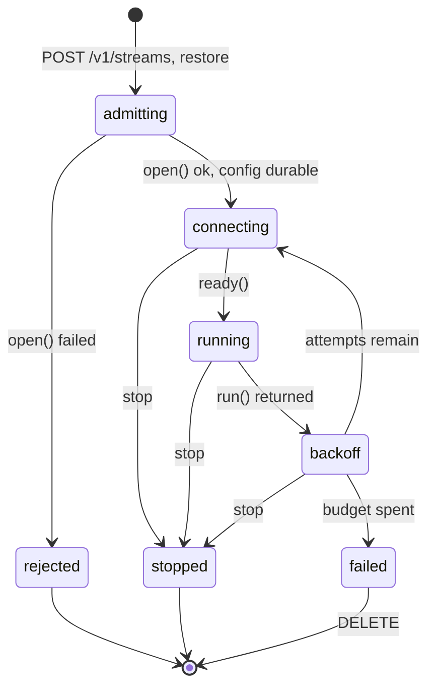

# Stream lifecycle

How a stream gets from an accepted configuration to a running connector, what a
`201 Created` guarantees, and what happens when a session ends. This is the
reference for [#59](https://github.com/AndreaBozzo/Nephtys/issues/59) and
[#15](https://github.com/AndreaBozzo/Nephtys/issues/15), which are two ends of
one mechanism and were built as one.

## 1. What this replaced

`StreamManager.Register` used to persist the config, spawn a goroutine, and
return `nil`. A `201 Created` therefore certified one thing: a goroutine had
been created. Four consequences followed.

**The API answered before the fact.** `WebhookSource.Start` set its status to
running and then handed `ListenAndServe` to a goroutine, so the stream reported
`status: running` / `health: healthy` with nothing bound. `GrpcSource.Start` did
the right thing — an explicit `net.Listen` whose error returned before the
status changed — and it made no difference, because that error went back into a
goroutine and was logged. The problem was not the connectors' ordering but that
no caller was waiting for the answer.

**Nothing arbitrated local resources.** Two webhook streams on port `8081` was
an accepted configuration. The manager kept no registry of claimed ports, and
`--config-check` sees one config with no knowledge of its peers, so neither
entry point could catch it. The second bind failed asynchronously, after the
config was already durable.

**A restored stream could be persisted and invisible.** `Restore` skipped a
persisted config that failed validation and left it in the KV bucket. The stream
existed in storage, was absent from `GET /v1/streams`, and appeared only as one
warning line at boot. Registration failure meant unregistered; restore failure
meant persisted and invisible.

**A supervisor added on its own would have been close to dead code.** #15 scoped
the restart policy to "a permanent `source.Start()` failure", but `Start` on
`websocket` and `sse` only ever returned `ctx.Err()` — they retried internally,
forever, on a hardcoded 1s→30s ladder, and `rest_poller` never returned at all.
A policy keyed on that return value would have applied only to push binds, while
the three connectors that actually retried kept an unbounded, unconfigurable
policy of their own.

So there is now one retry loop per stream, and the manager owns it. Connectors
run a single session and return. That is what makes the registration handshake
and the restart budget the same mechanism seen from two ends.

## 2. The state machine

Every stream of every kind moves through these states. The manager writes them;
no connector holds a status field, which removes the "running while unbound"
class rather than fixing the two instances of it that existed.



`failed` and `stopped` are terminal. Only `rejected` leaves nothing behind.

The vocabulary from [#11](https://github.com/AndreaBozzo/Nephtys/issues/11) is
unchanged: nothing was renamed or removed. The lifecycle states map onto the
existing `status`, `health`, and `nephtys_stream_state` values.

| Lifecycle state | `status` | `health` | gauge `state` | Registered | Config in KV |
| --- | --- | --- | --- | --- | --- |
| `admitting` | — | — | no series | no | not yet |
| `connecting` | `connecting` | `degraded` | `reconnecting` | yes | yes |
| `running` | `running` | `healthy` | `connected` | yes | yes |
| `backoff` | `reconnecting` | `degraded` | `reconnecting` | yes | yes |
| `failed` | `error` | `errored` | `errored` | yes | yes |
| `stopped` | `stopped` | `degraded` | `stopped` | until `Remove` returns | deleted first |
| `rejected` | — | — | no series | no | no |

`domain.StatusIdle` is no longer observable: a source is either pre-admission or
`connecting`. The constant stays, since the API surface only grows, but no
branch is written for it — `sourceHealth`'s default already covers the zero
value, and a dedicated case would be unreachable.

## 3. The source contract

`Start` used to mean "acquire, retry, serve, and report your own status,
forever". Splitting it is what lets a caller wait for the part that is
deterministic without waiting for the part that is not.

```go
type StreamSource interface {
	// Open acquires every local resource the source needs: a bound
	// listener, a parsed interval. It performs no I/O to a remote host.
	Open(ctx context.Context) error

	// Run serves or reads one session and returns when it ends. It calls
	// ready once the session is live, and returns nil when ctx is
	// cancelled. It does not retry.
	Run(ctx context.Context, publish PublishFunc, ready ReadyFunc) error

	// Close releases what Open acquired.
	Close()

	ID() string
}
```

`Status()` is gone from the interface, along with the status mutex each
connector carried. Lifecycle state is a fact about the supervised stream, not
about the connector.

| Kind | `Open` acquires | `Run` is | `ready()` fires | Session ends when |
| --- | --- | --- | --- | --- |
| `webhook` | `net.Listen(":"+port)` | `srv.Serve(lis)` | on entry — `Open` proved the bind | `Serve` returns, not `ErrServerClosed` |
| `grpc` | `net.Listen(":"+port)` | `srv.Serve(lis)` | on entry | `Serve` returns an error |
| `websocket` | nothing — no local resource | dial, then read loop | after handshake and `on_connect_send` | read error or EOF |
| `sse` | nothing | one GET, then frame scan | after 2xx | scanner error or EOF |
| `rest_poller` | parsed interval | ticker loop | on entry | cancellation only (see §9) |

**`Open` performs no remote I/O.** That rule is what lets the manager hold its
lock across it and lets a registration request block on it. It also decides
where the first dial goes — in `Run`, not `Open` — so a config write never fails
because a remote host happens to be down. `Open` is bounded by a 5s admission
timeout; reaching it would be a bug, and the deadline is there so such a bug
cannot hold the manager lock indefinitely.

## 4. Admission: what 201 means

Registration blocks on admission — everything local, deterministic and bounded.
It does not block on connection, which is remote, unbounded, and allowed to
flap.

```
Register, entirely under m.mu:

1. id unique?                         // 409 ErrStreamExists
2. port already claimed by a stream?  // 409, names the holder
3. pipeline.NewGeneration(...)        // 503, nothing acquired yet
4. source.Open(ctx)                   // 409, the bind is the authority
5. store.Put(cfg)                     // 503, then Close()
6. record claim, install maps, go supervise(id)
7. return nil                         // 201
```

The order matters. Persisting first, as the old code did, meant writing a config
for a stream that might not start and then deleting it again — a rollback that
could itself fail, and did have its own warning log line. Acquiring before
persisting removes that path; the only rollback left is `Close()` on a store
failure.

**A 201 now means:** the id is unique, the config is valid and durable, every
local resource the stream needs is held, and a supervisor owns it. It does not
mean an upstream is connected. The response body carries a `state` field
(`connecting` or `running`) next to the existing `status: "started"`.

### Registration outcomes

| Condition | Status | Body | Stored? |
| --- | --- | --- | --- |
| Config invalid | 400 | validator message | no |
| Duplicate id | 409 | `stream already registered` | no |
| Port held by another stream | 409 | `port already claimed: port 8081 is held by stream "sensor-hooks"` | no |
| Port held outside Nephtys | 409 | `stream resources unavailable: ... bind: address already in use` | no |
| Any other `Open` failure | 409 | the `Open` error verbatim | no |
| Pipeline build failure | 503 | `build pipeline: …` | no |
| Store refuses the write | 503 | `persist config: …` | no |

Every `Open` failure maps to 409, not only "address in use". Splitting them by
errno would buy a slightly finer taxonomy that the message already carries, and
would cost errno matching across Linux, macOS and Windows. A pipeline build
failure is 503 rather than 400 because the handler has already validated the
pipeline: reaching the builder with something it rejects means the validator and
the builder disagree, which is a server fault, not the caller's.

### Port claims

A `map[string]string` of port → stream id, guarded by `m.mu`. It exists so the
error can name the holder. The authority on whether a port is available is the
real `net.Listen` in `Open`, which also sees ports held by processes outside
Nephtys — a registry on its own would approve a port another process already
owns.

A claim covers a stream's whole registered life rather than one session: it
belongs to the configuration, and a restart has to be able to take the port
back. Claims are released by `Remove`.

`--config-check` cannot see this class of conflict, because it validates one
document with no knowledge of its peers. Port conflicts are an admission-time
check by construction.

## 5. Restart: one budget

The supervisor is the only retry loop in the process. It replaces the hardcoded
ladders that lived inside `websocket` and `sse`, so the policy is configurable
for the connectors that were already retrying, not only for the ones that never
did.

```go
attempt := 0
opened := true // Register already opened the source

for {
	if !opened {
		setStatus(reconnecting)
		if !sleep(ctx, policy.delay(attempt)) { setStatus(stopped); return }
		if err := source.Open(ctx); err != nil {
			recordFailure(err)
			if attempt, ok = policy.next(attempt); !ok { markFailed(); return }
			continue
		}
		opened = true
	}

	setStatus(connecting)
	runErr := source.Run(ctx, publish, func() { readyAt = now(); setStatus(running) })
	source.Close()
	opened = false

	if ctx.Err() != nil { setStatus(stopped); return }   // operator, never a restart
	if readyAt != 0 && now().Sub(readyAt) >= policy.resetAfter {
		attempt = 0                                      // budget earned back
	}
	recordFailure(runErr)
	if attempt, ok = policy.next(attempt); !ok { markFailed(); return }
}
```

The first attempt's `Open` is the one `Register` already made and answered the
request with. Every later attempt re-runs it, which is how a webhook whose
listener died gets its port back instead of needing a delete and re-create.

### The budget resets on uptime, not on connect

The old connector loops set `attempt = 0` as soon as a dial succeeded. Under an
unbounded ladder that is harmless. Under a bounded budget it is a bug: a source
that accepts and then drops immediately — a half-open upstream, a load balancer
draining, a TLS terminator rejecting after the handshake — resets the counter
every cycle and retries forever at the bottom of the ladder, never reaching a
state anything can alert on. The budget is earned back by staying up for
`reset_after` instead. A stream that reconnects cleanly once an hour never
exhausts a five-attempt budget; a flapping one reaches `failed` in seconds.

### Configuration

```json
{
  "restart": {
    "max_attempts": 10,
    "initial_backoff": "1s",
    "max_backoff": "30s",
    "factor": 2.0,
    "reset_after": "60s"
  }
}
```

Every field is optional and validated by `--config-check`. `max_attempts` is a
pointer in Go: absent means unlimited, `0` means never restart, negative is
rejected. Encoding "unlimited" as `0` would give an operator who writes `0` to
mean "leave it down" the opposite of what they asked for.

### Defaults preserve existing behaviour

| Kind | Default policy | Behaviour before | Same? |
| --- | --- | --- | --- |
| `websocket`, `sse` | unlimited, 1s→30s ×2, reset 60s | unlimited, 1s→30s ×2, reset on connect | yes, apart from the reset rule |
| `rest_poller` | policy inert — no session ends on its own | retries on the next tick | yes |
| `webhook`, `grpc` | `max_attempts: 0` | terminal on first failure | yes |

Push connectors default to no restart deliberately. Rebinding is now possible,
but making it the default would change a documented contract in the same release
that makes it configurable. Operators opt in by writing a policy.

### Giving up

A stream that spends its budget goes to `failed` and stays registered: config
persisted, port claim held, listed by `GET /v1/streams` as `status: error` /
`health: errored`, gauge on `errored`, with `restart_count`, `last_error` and
`last_error_at` to say why. Unregistering it would lose the reason it failed and
put the runtime out of step with the stored config, which is the divergence
`UpdatePipeline` and `Remove` already avoid. Recovery is `DELETE` then `POST`; a
dedicated restart endpoint is a reasonable follow-up and is not in this scope.

## 6. Startup

`Restore` runs the same admission path, with two differences that follow from
having no HTTP caller to answer.

- **An admission failure becomes a state rather than a response.** A persisted
  config whose port is taken is registered in `failed` with the bind error as
  `last_error`. At startup, "persisted but invisible" is the worst outcome
  available: the operator has nothing to delete and nothing explaining the
  missing data. A config that no longer validates is registered the same way,
  carrying the validation error, so a config written by an older version stays
  visible and removable. (Refusing to boot is the other coherent option, and is
  too harsh for an unattended edge daemon.)
- **Restore admits in sorted id order.** Two persisted streams can claim one
  port — the store holds whatever was accepted over time — and without an order,
  which one wins depends on map iteration. Sorting makes the winner the same
  across restarts.

Process-level readiness needed nothing new: `runService` completes `Restore`
before `srv.Start()`, so the REST API never serves a request while the stream
set is half-built. That ordering is now load-bearing and is commented as such.
`/health` still reports broker connectivity only — per-stream failure is what
`nephtys_stream_state{state="errored"}` is for, and folding it into the liveness
endpoint would make one dead stream look like a dead process. The roadmap's
separate liveness and readiness probes remain a distinct item; this gives them a
well-defined "restore complete" moment to key on.

## 7. Concurrency invariants

- **The supervisor goroutine never takes `m.mu`.** Per-stream mutable state
  (lifecycle state, attempt count, last error, last message) lives in
  `streamRuntime` as atomics. `Remove` holds the lock while waiting for the
  supervisor to finish, so reaching for it from the supervisor would deadlock.
- **One goroutine per stream, down from two.** The manager owns the state, so it
  writes the gauge at each transition; the one-second `trackSourceState` poller
  and its `stateDones` bookkeeping are gone.
- **The pipeline generation is stream-scoped, not session-scoped.** A restart
  never rebuilds it, so a batch buffered before a reconnect is still flushed by
  the generation that accepted it, and `UpdatePipeline` works the same during a
  backoff as during a session.
- **`Close` is called exactly once per `Open` that returned nil**, after `Run`
  returns. `Run` is never called without a successful `Open`.
- **Cancellation is never a restart.** The supervisor checks `ctx.Err()` before
  consulting the budget, so `Remove` and `StopAll` cannot race a rebind.
- **Teardown order:** cancel → supervisor returns → `done` closes → retire the
  generation (final flush) → release the port claim → delete the metric series.

## 8. Surface

No JSON field was renamed or removed.

| Surface | Added | Unchanged |
| --- | --- | --- |
| `StreamSourceConfig` | `restart` (optional block) | every existing field |
| `StreamInfo` | `restart_count`, `last_error`, `last_error_at` | `id`, `status`, `health`, `last_message_at` |
| `POST /v1/streams` → 201 | `state` | `id`, `status: "started"` |
| `POST /v1/streams` → 409 | port-conflict cases | duplicate-id case |
| Metrics | `nephtys_stream_restarts_total{stream_id}` | `nephtys_stream_state` and its four label values |
| `--config-check` | validates `restart` | every existing rule |

## 9. How it is verified

Each of these was checked against the code with the fix removed, one part at a
time, so the table says what each test actually discriminates rather than what
it covers.

| Test | Fails without | Does not discriminate |
| --- | --- | --- |
| `TestRegister_PortHeldByAnotherStream` | the port-claim registry | the synchronous `Open` — the bind alone cannot name the holder |
| `TestRegister_PortHeldOutsideNephtys` | admission waiting for `Open` | the claim registry, which cannot see another process |
| `TestCreateStream_PortConflictIsNot201` | admission waiting for `Open` | which of the two conflict sources it was |
| `TestNoStreamRunsWhileItsListenerIsUnbound` | admission waiting for `Open` | — |
| `TestSupervisor_FlapWithinResetWindowExhaustsBudget` | the uptime-based reset | the ladder itself |
| `TestSupervisor_UptimeEarnsBudgetBack` | — (passes under either reset rule) | pair it with the flap test |
| `TestRestore_UnbindableStreamStaysVisible` | restore registering failures | the sort order |
| `TestRestore_AdmitsInSortedOrder` | the sort, and restore registering failures | — |

Timing is not taken from the wall clock: the supervisor's `now` and `sleep` are
injected, and the tests replace them, so the reset window and the ladder are
exercised without waiting for either. The scripted test source parks on its
context once its script runs out, so a supervisor that restarts more often than
expected fails on the count rather than spinning.

## 10. Open questions

1. **Should a pull source ever block registration?** As built, a `websocket`
   with a mistyped host returns 201 with `state: connecting` and shows up
   through the gauge and `last_message_at`. An opt-in
   `wait_for_first_connect: "3s"` making admission wait for `ready()` would
   catch the typo at `POST` time, at the cost of a config write that can fail
   for a purely remote and transient reason.
2. **Push defaults.** `max_attempts: 0` for `webhook` and `grpc` preserves
   existing behaviour exactly. A small non-zero default would make a lost
   listener self-heal for operators who never read the restart docs.
3. **`rest_poller` has no session, so no policy reaches it.** A poller whose
   endpoint has been returning 404 for a day reads as `running` and `healthy`,
   with only `last_message_at` telling the truth. A `max_consecutive_failures`
   that ends the session would put it under the same budget as everything else.
